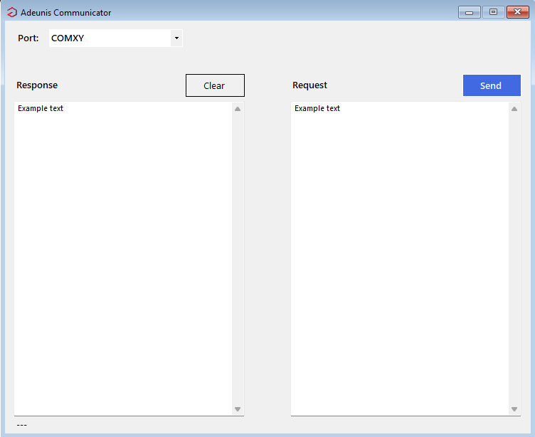

  

# AdenuisCommunicator

WPF application that can be used to handle communication of the Adenuis RF devices.

## Tested devices

* [Adenuis ARF868 LR 500mW Radio Modem](https://www.adeunis.com/en/produit/arf-868-lr-set-up-radio-transmission-for-long-distance-broadcasting/)

## Usage

You must make sure that the devices are set to Transparent mode, and that their baudrate is 115200.

Open the application and set the COM port of the connected device.

### Use-case: Sending

Type in the data you want to send to the text box under the _Request_ label, then click on the _Send_ button.

### Use-case: Receiving

If the device receives data it will appear in the text box under the _Response_ label.

## License

Copyright (C) 2024 Martin Kondor
